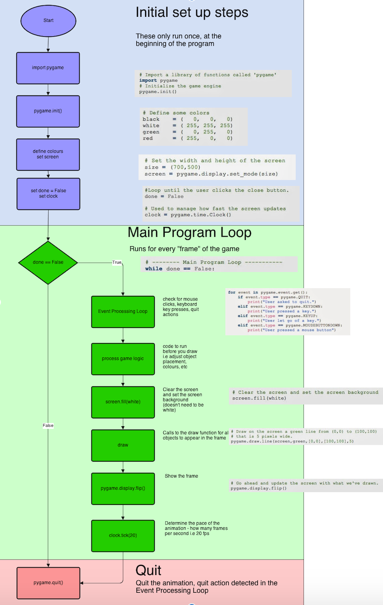

Paste your current/final repl.it link here --> (https://repl.it/join/wlrqumef-shiuman)  
**Be sure it is shared with @EricFabroa**

# Pygame Workflow

'''
-------------------------------------------------------------------------------
Name:      main.py
Purpose:   Hockey game 

Author:    Shiu.R

Created:    07/01/2021
------------------------------------------------------------------------------
'''
""" 
A basic pygame template
"""
 
import pygame
 
# Define some colors
BLACK    = (   0,   0,   0)
WHITE    = ( 255, 255, 255)
GREEN    = (   0, 255,   0)
RED      = ( 255,   0,   0)
 
pygame.init()
  
# Set the width and height of the screen [width, height]
size = (800, 500)
screen = pygame.display.set_mode(size)
 
pygame.display.set_caption("My Game")
 
#Load graphics
background_image = pygame.image.load("background.jpg").convert()
net_image = pygame.image.load("Ice-Hockey-Net.png").convert_alpha()
player_image = pygame.image.load("puck.png").convert_alpha()
contract_image = pygame.image.load("contract.png").convert_alpha()
all_star_image = pygame.image.load("all star.png").convert_alpha()
all_star_game_image = pygame.image.load("all star game.jpg").convert_alpha()
home_button_image = pygame.image.load("home button.png").convert_alpha()
background_image2 = pygame.image.load("home.jpg").convert_alpha()
questions_image = pygame.image.load("question_mark.png").convert_alpha()
blank_image = pygame.image.load("Blank_image.png").convert_alpha()
blank2_image = pygame.image.load("Blank_image2.png").convert_alpha()
true_button = pygame.image.load("true_button.png").convert_alpha()
false_button = pygame.image.load("false_button.webp").convert_alpha()
next_button = pygame.image.load("next.png").convert_alpha()

#Set positions of graphics
background_position = [0,7]

#Variables for loop
score = 0
true_switch = 0
false_switch = 0

#select the font, size, and italics
font = pygame.font.SysFont('Calibri', 18, True, False)
score_text = font.render(str(score) , True, WHITE)
blank_text = font.render(" " , True , WHITE)
blank_text_true = font.render(" " , True , WHITE)
blank_text_false = font.render(" ", True, WHITE)
question_1 = font.render("Trojan is the least dangerous malware." , True , WHITE)
question_2 = font.render("Will this have an error?: print(hi)" , True , WHITE)
answer_true = font.render("WRONG -50 points", True, WHITE)
answer_false = font.render("CORRECT +50 points", True, WHITE)
lost_achievements = font.render("Score under 10, lost achievements" , True ,  WHITE)

#Loop until the user clicks the close button.
done = False
button_appear = False

# Used to manage how fast the screen updates
clock = pygame.time.Clock()

#Initilize box properties
net_x = 500
net_y = 250
contract_x = 50
contract_y = 400
all_star_x = 100
all_star_y = 400
home_button_x = 23
home_button_y = 1
questions_x = 740
questions_y = 1
blank_x = 300
blank_y = 100
blank2_x = 500
blank2_y = 100
next_x = 380
next_y = 100

#Size images
net_image = pygame.transform.scale(net_image, (250,150))
player_image = pygame.transform.scale(player_image, (25,25))
contract_image = pygame.transform.scale(contract_image, (75,75))
all_star_image = pygame.transform.scale(all_star_image, (75,75))
home_button_image = pygame.transform.scale(home_button_image, (50,50))
questions_image = pygame.transform.scale(questions_image, (50,50))
blank_image = pygame.transform.scale(blank_image, (25,25))
true_button = pygame.transform.scale(true_button, (25,25))
false_button = pygame.transform.scale(false_button, (25,25))
next_button = pygame.transform.scale(next_button, (90,60))

# -------- Main Program Loop -----------
while not done:
    # --- Main event loop
    pos = pygame.mouse.get_pos()
    for event in pygame.event.get(): # User did something
        if event.type == pygame.QUIT: # If user clicked close
            done = True # Flag that we are done so we exit this loop
        if event.type == pygame.MOUSEBUTTONDOWN:
          x = pos[0]
          y = pos[1]
          if x>530 and x<700 and y>245 and y<375:
           score = score + 1

          if score>=10 and x>0 and x<100 and y>385 and y<500:
            score = score + 25

          if score>25 and x>101 and x<201 and y>385 and y <500:
            background_image = all_star_game_image

          if x>1 and x<100 and y>1 and y <100:
            background_image = background_image2
            screen.blit(background_image2, background_position)

          if x>725 and x<800 and y>0 and y<50:
            blank_text = question_1
            blank_image = true_button
            blank2_image = false_button
            true_switch = 1
            false_switch = 1

          if true_switch>0 and x>286 and x<314 and y>86 and y<114:
            blank_text_true = answer_true
            score = score - 50
            

          if false_switch>0 and x>486 and x<514 and y>86 and y<114:
            score = score + 50
            blank_text_false = answer_false

          if x>365 and x<470 and y>90 and y<140:
            answer_false = blank_text_false
            answer_true = blank_text_true

          if x>365 and x<470 and y>90 and y<140:
            question_1 = blank_text
            blank_text = question_2
 

          if true_switch>0 and x>286 and x<314 and y>86 and y<114:
            blank_text_true = answer_true
            score = score - 50
            

          if false_switch>0 and x>486 and x<514 and y>86 and y<114:
            score = score + 50
            blank_text_false = answer_false
           
           
            
          """"
          if score> 10:
            """

          
           

#Add answer questions to move on
  
    score_text = font.render(str(score) , True, WHITE)

    # --- Game logic should go here

     # Get the current mouse position. This returns the position
    # as a list of two numbers.
    player_position = pygame.mouse.get_pos()
    player_x = player_position[0]
    player_y = player_position[1]

    # First, clear the screen to white or whatever background colour. 
    # Don't put other drawing commands above this, or they will be erased with this command.
    """"
    screen.fill(WHITE)
    """
    # --- Drawing code should go here
     
    
    #Copy image here
    
    screen.blit(background_image, background_position)
    screen.blit(net_image, [net_x, net_y])
    screen.blit(player_image, [player_x, player_y])
    screen.blit(home_button_image, [home_button_x, home_button_y])
    screen.blit(blank_image, [blank_x, blank_y])
    screen.blit(blank2_image, [blank2_x, blank2_y])
    screen.blit(next_button, [next_x, next_y])
    screen.blit(player_image, [player_x, player_y])
    screen.blit(blank_text, [250,25])
    screen.blit(blank_text_true, [300,125])
    screen.blit(blank_text_false, [500,120])

    
    screen.blit(questions_image, [questions_x, questions_y])
    if score >= 10:
      screen.blit(contract_image, [contract_x, contract_y])
    if score >= 25:
      screen.blit(all_star_image, [all_star_x, all_star_y])

   
   #Add text to screen
    screen.blit(score_text, [623, 230])

    # --- Go ahead and update the screen with what we've drawn.
    pygame.display.flip()
 
    # --- Limit to 60 frames per second
    clock.tick(60)
     
# Close the window and quit.
# If you forget this line, the program will 'hang'
# on exit if running from IDLE.
pygame.quit()
